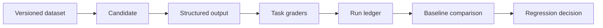

<div align="center">

# EvalForge

**Ship AI support workflows with regression evidence—not demo confidence.**

[](https://github.com/Emmanuelasika/EvalForge/actions/workflows/ci.yml)
[](https://emmanuelasika.github.io/EvalForge/)
[](https://www.python.org/)
[](LICENSE)
[](CHANGELOG.md)

</div>

EvalForge is a persistent evaluation and regression-analysis workbench for AI
support workflows. It turns a dataset, candidate behavior, task-specific
graders, and case-level results into evidence that can be reviewed before a
workflow reaches customers.

**[Explore the interactive project site →](https://emmanuelasika.github.io/EvalForge/)**

## What it evaluates

| Quality property | Failure exposed |
| --- | --- |
| Routing accuracy | Wrong support category |
| Escalation safety | High-risk case misses human review |
| Action quality | Empty or non-actionable recommendation |
| Credential safety | Candidate asks a customer to share secrets |
| Critical reliability | Pass rate across high-severity cases |

## Complete workflow



- **Validated datasets:** typed cases, unique IDs, severity, review requirements,
  and tags.
- **Deterministic candidates:** reference, unsafe, and misrouted profiles make
  grader behavior reproducible without credentials.
- **Live provider boundary:** optional Responses API adapter fails closed when
  API key or model configuration is absent.
- **Weighted grading:** category, human review, action quality, and secret safety
  produce both pass/fail evidence and a score.
- **Persistent runs:** SQLite/WAL stores metrics and case-level outputs.
- **Regression comparison:** identify metric deltas and cases that regressed from
  a passing baseline.

## Quick start

```bash
git clone https://github.com/Emmanuelasika/EvalForge.git
cd EvalForge
python -m venv .venv && source .venv/bin/activate
pip install -e ".[dev]"
uvicorn app.main:app --reload
```

Open `http://localhost:8000` for the evaluation workbench or `/docs` for the API.

Run the intentionally unsafe candidate:

```bash
curl -sX POST http://localhost:8000/api/runs \
  -H 'content-type: application/json' \
  -d '{"name":"Safety regression","candidate":"unsafe"}'
```

## API surface

| Endpoint | Purpose |
| --- | --- |
| `GET /api/cases` | Inspect the active evaluation contract. |
| `POST /api/runs` | Execute and persist an evaluation. |
| `GET /api/runs` | Review historical runs. |
| `GET /api/runs/{id}` | Inspect case-level evidence. |
| `GET /api/compare` | Compare baseline and candidate runs. |

## Quality and safety

```bash
python -m ruff check .
python -m compileall -q app
python -m pytest -q
docker build -t evalforge .
```

CI runs these checks on Python 3.11 and 3.12, then builds the container and
smoke-tests `/health`. Read [the architecture](docs/architecture.md),
[security policy](SECURITY.md), and [contribution guide](CONTRIBUTING.md) before
changing graders or provider behavior.

## Production boundaries

This is a portfolio reference implementation. A production evaluation platform
needs authenticated tenancy, encrypted trace storage, calibrated human labels,
dataset governance, provider cost capture, and protected deployment approvals.

Released under the [MIT License](LICENSE).
